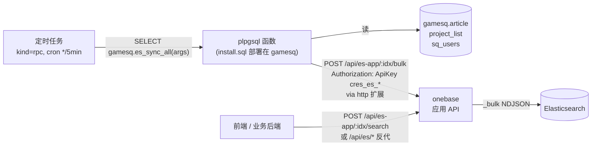

# Acme → Elasticsearch 同步与搜索（纯配置方案）

把 `gamesq.article` / `gamesq.project_list` / `gamesq.sq_users` 三张表周期性同步到 Elasticsearch，再让业务通过 HTTP 关键词检索——**全程不修改 onebase 代码、不部署外部脚本**。

## 数据流



**关键点**：ES 的真实 URL / 账密**只配在 onebase【ES 反向代理】里一份**；PG 这边只需要知道 onebase 在哪、以及一个 `cres_es_*` token。同步、删除、查询都走 onebase 应用 API，token 自带 method/index 白名单审计。

---

## 第 0 步：装 `http` 扩展（一次性，DBA 做）

> 整个方案唯一需要走 DBA / RDS 控制台的步骤。onebase SQL 编辑器里跑的角色通常不是 superuser，没法自助 `CREATE EXTENSION`，所以**必须先在 DBA 这边做好**。

- **阿里云 RDS PG**：控制台 → 实例 → 扩展管理 → 搜 `http` → 安装。
- **自建 PG**：宿主机 `apt install postgresql-<ver>-pgsql-http`，再用 superuser 在目标库执行：
  ```sql
  CREATE EXTENSION http;
  ```

校验（在 onebase SQL 编辑器里跑这一条，确认装好即可，schema 不要求必须是 `public`）：

```sql
SELECT extname,
       extnamespace::regnamespace AS schema,
       extversion
FROM pg_extension
WHERE extname = 'http';
-- 期望：http | <任意 schema> | 1.5+
```

`install.sql` 会在运行时动态读取 `http` 扩展实际所在的 schema，并据此调用 `http()` / `http_header()` / `http_request`，所以托管库把扩展装在 `extensions`、`public` 或别的 schema 都可以。

## 第 1 步：在 onebase【ES 反向代理】里申请一个 token

1. onebase 控制台 → 【ES 反向代理】→ 选既有的"测试ES"连接（截图里那条）→ 切到 `代理 Token` 标签 → 新建 token。
2. 配置：
   - **methods_allow**：`GET, POST, PUT, DELETE`（_init 用 POST，bulk 用 POST，delete index 用 DELETE）
   - **indices_allow**：`way_article_search_main, way_community_search, way_user_search`
   - **path_denylist**：保持默认（拦掉 `_cluster`、`_security` 等）
3. 拷贝出来的 `cres_es_xxxxxxxxxxxx`，下一步要用。token 只在新建时显示一次。

> 这个 token 只给"PG 调 onebase"用，与给前端用的 token 是分开的两份（前端的可以只给 `GET`/`POST`，indices 限定一样）。

## 第 2 步：apply `install.sql`

打开 onebase 控制台 → 左侧【SQL 查询】→ **左上角连接选 `acme_test`（库 supabase, schema gamesq）**，把 `docs/acme-es-sync/install.sql` 整份复制进去，点执行。

脚本完全幂等：`CREATE OR REPLACE FUNCTION` + `CREATE TABLE IF NOT EXISTS` + `INSERT ON CONFLICT DO NOTHING`，可以反复 apply。

成功后这些对象会出现在 `gamesq` schema 里：

| 对象 | 说明 |
| --- | --- |
| `_es_sync_config` | 设置表（onebase URL / token / 索引名 / batch） |
| `_es_setting / _strip_html / _parse_tac / _parse_description` | 工具 |
| `_es_call(method, path, body)` | onebase HTTP 客户端（自动加 `Authorization: ApiKey ...`） |
| `_es_bulk(idx, ops)` | 调 `/api/es-app/:idx/bulk` 并统计 ok/fail |
| `_es_common_settings / _es_*_fields` | 索引 mapping 片段 |
| `_es_ensure_index / es_init_indices` | 调 `/api/es-app/:idx/_init` 建索引 |
| `es_sync_articles / es_sync_communities / es_sync_users` | 三个实体同步函数 |
| **`es_sync_all(int, boolean)`** | **总入口**，rpc 任务调它即可 |

## 第 3 步：把设置表填成真实值

```sql
-- onebase HTTP 入口。注意必须是 PG 这台机器能访问到的地址：
--   · 单机部署：http://127.0.0.1:3006
--   · 远端 RDS + 公网 onebase：填 onebase 的公网域名 / 反代地址
UPDATE gamesq._es_sync_config SET value = 'http://127.0.0.1:3006' WHERE key = 'onebase_base_url';

-- 第 1 步拿到的 token
UPDATE gamesq._es_sync_config SET value = 'cres_es_粘贴你拿到的真实 token' WHERE key = 'onebase_es_token';

-- 索引名、batch 默认就是参考程序那一套；如需覆盖再 UPDATE
-- UPDATE gamesq._es_sync_config SET value = 'way_article_search_main' WHERE key = 'article_index';
-- UPDATE gamesq._es_sync_config SET value = '500' WHERE key = 'article_batch';

SELECT * FROM gamesq._es_sync_config;
```

> 这张表只有 schema 内权限够的角色能读。`onebase_es_token` 还是会以明文存在于 `_es_sync_config.value` —— 这是必须的（PG 没有内置 secrets 管理），ES 真正的账密在 onebase 那边、不在这里。

## 第 4 步：在 SQL 控制台验证一次

> ⚠️ **onebase SQL 编辑器有 30s 查询超时**（后端为防误操作写死，UI 改不了）。下面给的命令都是按"≤30s 能跑完"挑的；**真正的同步以及全量都必须走第 5 步的调度器**（调度器每个任务的 `timeout_secs` 独立配置，默认能跑几百秒以上）。

### 4.1 建索引（幂等；第一次 created，之后 exists）

```sql
SELECT gamesq.es_init_indices();
-- 预期：{"way_article_search_main": "created", "way_community_search": "created", "way_user_search": "created"}
```

### 4.2 轻量通路检查（30s 内一定能返回，不扫源表）

```sql
SELECT gamesq.es_health();
```

底层走 `POST /api/es-app/:idx/count`（body 空 `{}`），返回每个索引的当前文档数 + 单次 HTTP 往返耗时：

```json
{
  "way_article_search_main": { "status": 200, "elapsed_ms": 60, "count": 0,    "error": null },
  "way_community_search":    { "status": 200, "elapsed_ms": 22, "count": 0,    "error": null },
  "way_user_search":         { "status": 200, "elapsed_ms": 18, "count": 0,    "error": null }
}
```

- 三条都 `status: 200` 说明 PG ↔ onebase ↔ ES 全链路通了，token 也对
- `elapsed_ms` < 100ms 说明链路很快；普遍 > 500ms 才需要担心网络
- 任意一条返回 4xx/5xx → 看 `error` 字段；常见：
  - `403` → token 的 `methods_allow` 没勾 POST、或 `indices_allow` 没包含该索引（去【ES 反向代理 → 代理 Token】扩白名单）
  - `404` → 索引还没建（先跑 4.1 的 `es_init_indices()`）
  - `401` → token 拼错或被吊销（回第 1 步重新申请）

### 4.3 单实体小窗口同步（验证 _bulk 通路 + 数据形状）

> 千万**不要**在 SQL 编辑器里直接跑 `SELECT gamesq.es_sync_all(60);`——它把三个实体串到一起，30s 几乎一定超。

挑数据量最小的实体（通常是 community）+ 极小时间窗，分开跑：

```sql
-- 只回看 1 分钟的社区变更（一般 0~几条），≤2s 应该能返回
SELECT gamesq.es_sync_communities(now() - interval '1 minute');

-- 用户表大，先用 10 秒窗口试水
SELECT gamesq.es_sync_users(now() - interval '10 seconds');

-- 文章表通常最大，用 10 秒窗口；如果还超时见下方"慢的话怎么办"
SELECT gamesq.es_sync_articles(now() - interval '10 seconds');
```

每条都返回类似：

```json
{
  "entity": "article",
  "index":  "way_article_search_main",
  "since":  "2026-05-26T07:23:00+00:00",
  "upsert_ok": 3, "upsert_fail": 0,
  "delete_ok": 0, "delete_fail": 0,
  "elapsed_ms": 420
}
```

`upsert_fail` / `delete_fail` 非 0 时，去 onebase【ES 反向代理 → 代理 Token】里看该 token 的最近调用日志，能定位是哪个 op 失败。

### 4.4 慢的话怎么办

| 现象 | 诊断 | 处置 |
| --- | --- | --- |
| `es_sync_all(60)` 超时，但 `es_health()` 正常 | 三个实体串行 + HTTP 往返累计 > 30s | 不在 SQL 编辑器跑，直接配第 5 步调度任务跑 |
| 单跑 `es_sync_articles(now() - interval '10 seconds')` 都超时 | 多半是 `gamesq.article.updated_at` 没索引，全表扫 | 让 DBA 加索引（见下） |
| `es_health()` 的 `elapsed_ms` 普遍 > 500ms | PG 到 onebase 网络远 | 把 onebase 部署得离 PG 近一点；或调小 `*_batch` 减少单次 op 数（默认 article=500/community=200/user=500） |

源表索引建议（DBA 跑）——大表必备，否则增量同步会随表线性变慢：

```sql
CREATE INDEX CONCURRENTLY IF NOT EXISTS idx_article_updated_at      ON gamesq.article (updated_at);
CREATE INDEX CONCURRENTLY IF NOT EXISTS idx_project_list_updated_at ON gamesq.project_list (updated_at);
CREATE INDEX CONCURRENTLY IF NOT EXISTS idx_sq_users_created_at     ON gamesq.sq_users (created_at);
CREATE INDEX CONCURRENTLY IF NOT EXISTS idx_sq_users_last_active    ON gamesq.sq_users (last_active_time);
```

### 4.5 全量回填 = 直接配第 5.2 节那条调度任务，**手动 trigger 一次**就行

不要在 SQL 编辑器跑 `SELECT gamesq.es_sync_all(NULL);`——几十万行不可能 30s 内完成。

## 第 5 步：在【定时任务】UI 里建两条 rpc 任务

进 onebase【定时任务】→ 新建。**左上角连接确保选的是 `acme_test`**（决定任务的 `database_id`，rpc 在该库执行）。

### 5.1 增量同步（每 5 分钟）

| 字段 | 值 |
| --- | --- |
| 名称 | `Acme ES 增量同步` |
| 描述 | `每 5min 回看 10min，同步新数据 + 清理软删` |
| 任务类型 | `RPC 调用` |
| cron 表达式 | `*/5 * * * *` |
| 时区 | `UTC` |
| overlap_policy | `skip` |
| 超时 (秒) | `120` |
| 最大重试 | `0` |
| 连接 / database_id | `acme_test` |
| schema | `gamesq` |
| 函数名 | `es_sync_all` |
| 实参 (rpc_args) | 见下方 |

```json
{
  "p_window_seconds": 600,
  "p_ensure_indices": false
}
```

> `p_ensure_indices=false`：每次增量不再回打一次 `_init`，省 3 次小往返。索引初始化交给全量。

### 5.2 全量同步（每天 UTC 03:00）

| 字段 | 值 |
| --- | --- |
| 名称 | `Acme ES 全量同步` |
| cron 表达式 | `0 3 * * *`（UTC，对应北京时间 11:00） |
| 超时 (秒) | `1800`（按表行数调） |
| schema / 函数名 | `gamesq` / `es_sync_all` |
| 实参 | `{ "p_window_seconds": null, "p_ensure_indices": true }` |

> 全量不带 since，扫表 + bulk index 全部活跃行。`_id` 固定，ES 做版本覆盖不会产生重复文档。
> mapping 升级流程：先 `SELECT gamesq.es_init_indices(true);`（**破坏性**，会先 DELETE 后重建索引），再跑全量。

### 5.3 RPC 授权（首次跑遇到 403 时）

进【RPC 调用】→ 找 `gamesq.es_sync_all` → 给当前用户所属角色加 `EXECUTE`。
首次没配过 EXECUTE 行时是兼容模式（任意登录用户可调）；一旦配过任何一行就严格 RBAC。

## 第 6 步：业务搜索

同步好之后业务侧两种方式查 ES，**都走 onebase，不需要业务方知道 ES 的真实地址/密码**。

### 6.1 简化查询：`/api/es-app/:index/search`（适合社区 / 用户）

```http
POST /api/es-app/way_community_search/search
Content-Type: application/json
Authorization: ApiKey cres_es_业务端的查询 token   或   Bearer <JWT>

{
  "q": "矩阵",
  "q_fields": ["show_name^3", "name^2", "show_name_cn^2",
               "show_name.autocomplete", "name.autocomplete"],
  "where": { "status": 1, "is_private": 0 },
  "sort":  [{ "field": "_score", "order": "desc" },
            { "field": "follow_count", "order": "desc" }],
  "page": 1, "size": 10
}
```

```http
POST /api/es-app/way_user_search/search
Authorization: ApiKey cres_es_xxx
Content-Type: application/json

{
  "q": "alice",
  "q_fields": ["username^3", "username.autocomplete^2", "user_desc"],
  "sort": [{ "field": "_score", "order": "desc" },
           { "field": "last_active_time", "order": "desc" }],
  "page": 1, "size": 10
}
```

### 6.2 完整 DSL：`/api/es/*es_path` 反代（帖子必须走这条，因为 title/content 是 nested）

简化版 search 不支持 `nested` 查询，所以帖子要用反代：

```http
POST /api/es/way_article_search_main/_search
Content-Type: application/json
Authorization: ApiKey cres_es_xxx

{
  "from": 0, "size": 10,
  "query": { "bool": {
    "filter": [
      { "term": { "delete_status": 0 } },
      { "term": { "hide_status":   0 } }
    ],
    "must": [{ "bool": { "minimum_should_match": 1, "should": [
      { "nested": { "path": "title",
          "query": { "bool": { "should": [
            { "match": { "title.value":              { "query": "新版本", "boost": 3 } } },
            { "match": { "title.value.autocomplete": { "query": "新版本", "boost": 1 } } }
          ] } },
          "inner_hits": { "highlight": { "fields": { "title.value": {} } } } } },
      { "nested": { "path": "content",
          "query": { "bool": { "should": [
            { "match": { "content.value":              { "query": "新版本", "boost": 1 } } },
            { "match": { "content.value.autocomplete": { "query": "新版本", "boost": 0.5 } } }
          ] } },
          "inner_hits": { "highlight": { "fields": { "content.value": {} } } } } }
    ] } }]
  } },
  "sort": [{ "_score": "desc" }, { "created_at": "desc" }]
}
```

按社区过滤：`filter` 数组加 `{ "term": { "project_id": 1234 } }`。

### 6.3 全局聚合（一次查三类）

应用 API 和反代都不带"分组聚合"接口。最简单的做法是**业务后端**并发调上面 3 个搜索（前端不应直接持有 ES token），合并响应再返回前端。

---

## 工作原理（速读）

- 同步函数都长这样：分页扫源表 → `jsonb_agg` 拼一个 `[{action:"index", id:"...", doc:{...}}, ...]` 数组 → 调 `_es_bulk(idx, ops)`，后者 POST 给 `/api/es-app/{idx}/bulk`，onebase 帮转 ES `_bulk` NDJSON，返回 `{results:[{ok:bool,...}]}` 后我们就地 count。
- 增量模式两遍：先 upsert `updated_at >= since` 的活跃记录；然后扫"刚刚 delete_status≠0 / hide_status≠0 / status≠1 / is_private≠0 / ban_account≠0 / username=''"的记录，调 `_bulk` 用 `action:delete` 把它们从 ES 移除。
- 全量不走 delete：直接 upsert 全部活跃记录。要彻底清理过期文档就 `es_init_indices(true)` 重建索引后全量。
- onebase 调度器多实例时不会重复跑同一条 task（`runner.rs` 的 claim 索引约束）；rpc 函数在 `database_id` 指向的租户库执行。
- `http` 扩展同步阻塞 PG backend，但我们一次 bulk 只发 ≤500 op、过 onebase（同机 / 内网），延迟通常 <200ms，对 PG 连接占用很短。

## 排错

| 现象 | 原因 / 处置 |
| --- | --- |
| apply 时 `type "http_response"` / `type "public.http_response" does not exist (SQLSTATE 42704)` | 旧版本脚本把扩展 schema 写死成了 `public`。重跑最新版 `install.sql`；新版本会动态读取 `pg_extension.extnamespace`，扩展装在 `extensions` / `public` / 其它 schema 都可以 |
| 在 SQL 编辑器跑 `es_sync_all(60)` 报 `timeout of 30000ms exceeded` | onebase SQL 编辑器写死 30s 上限，不是脚本问题。换用第 4.2 节的 `es_health()` 验通路 + 第 4.3 节单实体小窗口验数据形状；真正运行去第 5 步配调度任务 |
| apply `install.sql` 时 `extension "http" must be installed by superuser` | RDS 上让 DBA 在控制台勾装；自建 PG 用 `postgres` 角色装 |
| `gamesq._es_sync_config.onebase_base_url 未配置` | 第 3 步的 UPDATE 没跑，或写到了别的库 |
| `gamesq._es_sync_config.onebase_es_token 未配置或仍是占位值` | 同上，token 还是 `cres_es_REPLACE_ME` |
| `bulk way_xxx failed: status=401 body={"error":"invalid token"}` | token 拼错；或者 onebase 那边把 token 删了；回第 1 步重新申请 |
| `bulk way_xxx failed: status=403` | token 的 `methods_allow` / `indices_allow` 不包含本次调用；去【ES 反向代理 → 代理 Token】扩白名单 |
| `bulk way_xxx failed: status=502/503/timeout` | onebase 不可达或挂了；检查 `onebase_base_url` 在 PG 这台机器上能不能 `curl` 通；公网 RDS + 内网 onebase 要走反代/公网入口 |
| `_init way_article_search_main failed ... mapper_parsing_exception` | mapping 与既有索引冲突（多半是先用了 dynamic mapping）。处置：`SELECT gamesq.es_init_indices(true);` 重建 + 全量回填 |
| 任务运行历史里 `output.entities.article.upsert_fail` > 0 | 部分 doc 写入失败，到【ES 反向代理 → 代理 Token】看该 token 最近调用的失败响应，定位到具体 doc / 字段 |
| `_es_bulk: operations 超过 1000 条上限` | 不会发生（batch ≤ 500），如果触发说明谁手动改大了 `_es_sync_config.*_batch`；调回去 |

---

## 文件清单

```
docs/acme-es-sync/
├── README.md         本文件
└── install.sql       PG 函数 / 设置表 / 索引 mapping（一次性 apply）
```

`install.sql` 已通过 `pglast` 解析校验（8 个 plpgsql 函数 + 顶层 DDL 全 OK），但**正式上线前请按第 0–4 步在测试 schema 走一遍**，把 mapping 与源表列类型 / 业务 JSON 格式上的差异提前暴露出来。
