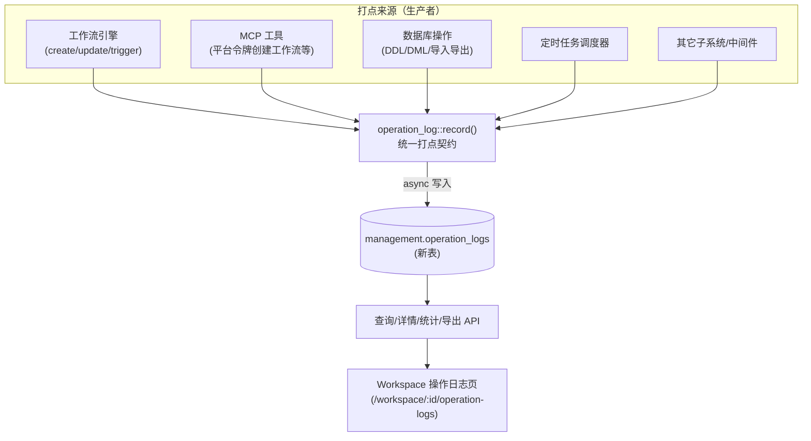
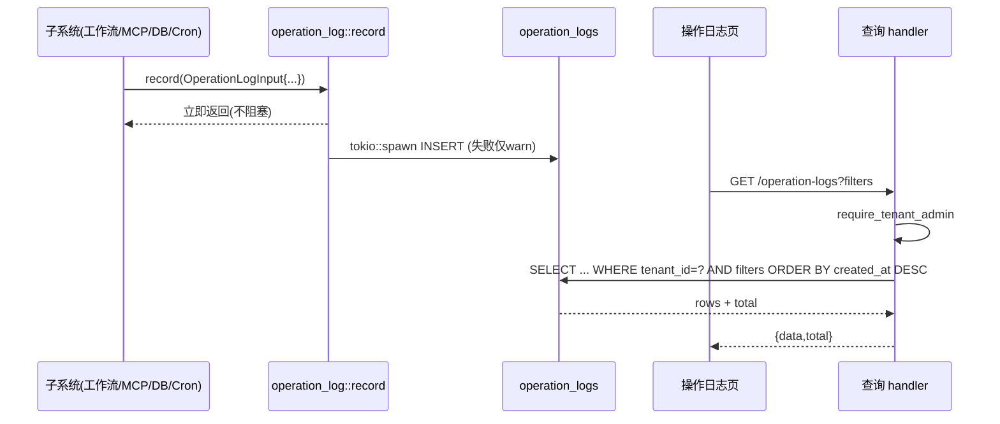

# 操作日志（Operation Logs）设计方案

> 状态：Proposed（待评审）
> 分支：`feature/operation-log`
> 关联设计稿：`~/Downloads/index (3).html`（UI 由需求方另行优化）

---

## 1. 背景与范围 (Context & Scope)

OneBase 已有两套「日志」体系，但都不满足「面向租户、跨来源、带业务语义」的操作审计需求：

- `management.audit_logs`：由全局 `audit_middleware` 自动写入，**形态是 HTTP 请求**（method/path/status），只记录 POST/PATCH/PUT/DELETE，偏**平台超管视角**。无法表达 MCP / 定时 / 系统内部这类**非 HTTP** 的操作，也没有 `resource_type` / `source` / `actor_type` 等业务维度。
- `management.execution_index` / `workflow_runs` / `scheduled_task_runs`：**执行日志**（任务跑没跑成功），与「谁对什么资源做了什么操作」是不同关注点。

本次要做一个**独立的、通用的操作日志**：项目（租户）成员可查看本项目内「谁 / 通过什么来源 / 对哪个资源 / 做了什么 / 成功与否」，并可多维筛选、查看详情、导出。打点来源需覆盖**工作流（含通过 MCP 创建）、数据库操作、定时任务、以及未来任意子系统**——只要调用方按统一契约传参即可落库。

### 系统上下文图



---

## 2. 目标与非目标 (Goals / Non-Goals)

### 目标

1. 新建独立表 `management.operation_logs`，字段可覆盖设计稿全部展示项，并为未来扩展留 `detail JSONB`。
2. 提供**通用打点契约**：任意子系统按统一入参 `record(OperationLogInput)` 即可落库，不感知底层是否配置 DB、不阻塞主流程。
3. 打点覆盖：工作流（含 MCP 创建）、数据库操作、定时任务、导出操作；后续可增量接入。
4. 提供查询接口：列表（多维筛选 + 分页）、单条详情、统计（卡片 + Tab 计数）、操作人下拉数据源、导出。
5. **租户隔离**：仅项目 admin+ 可查看本项目日志。
6. 筛选维度与表字段一一映射（操作人/动作/资源类型/资源对象/来源/状态/时间）。
7. **变更内容"写事实、读格式化"**：打点时存**结构化事实**（机器可读 before/after / diff，带版本 `v`）；**读取时由后端 formatter 格式化**成可读视图，前端只呈现。目标是「改展示只改 formatter 一处、历史零迁移」，同时事实不可变。

### 非目标

- **不做后端自动 diff（对比数据库旧值快照）**：由打点方在调用点提供结构化 before/after 事实；系统不去自动抓取/比对旧值。
- **不在打点时渲染文本、也不以裸 JSON 为主展示**：打点存结构化事实，读时后端格式化成视图（见 4.2.1）。
- **不审计只读查询（GET/READ）**；但**导出操作要记**（导出属敏感行为）。
- 不替换 / 迁移现有 `audit_logs`、`execution_index`（两者保留，各司其职；可选做弱关联）。
- 本期不做跨项目/平台超管全局视角页面（接口预留 tenant 过滤，页面后续再说）。
- 不做日志实时推送/告警（未来可基于本表叠加）。

---

## 3. 需求 (Requirements)

### 功能性

- FR1 列表：按 操作人 / 动作 / 资源类型 / 资源对象名 / 来源 / 状态 / 时间范围 过滤；分页；按时间倒序。
- FR2 Tab：全部 / 失败 / 高危 / 我的操作（当前用户）。
- FR3 统计卡片：今日操作总数、活跃操作人、失败数、高危数（随筛选联动）。
- FR4 详情：来源、请求方法/路径、资源对象、IP、租户、会话、UA、结果/错误、SQL（如有）等。
- FR4b 变更内容：按动作类型展示——创建（对象摘要）/ 删除（被删对象摘要）/ 修改（分组 + 字段 `old→new`）。数据流为「打点存结构化事实 → 读时后端 `format_change()` 出视图 → 前端呈现」（见 4.2.1）。
- FR5 导出：按当前筛选导出 CSV，且**导出行为本身**产生一条操作日志。
- FR6 操作人下拉数据源（支持 `?q=` 搜索，兼顾未来大用户量）。
- FR7 通用打点：工作流/MCP/DB/定时/其它来源均可写入。

### 非功能性

- NFR1 打点**不阻塞、不失败传播**：异步写入，失败仅告警，绝不影响主业务。
- NFR2 查询性能：常见筛选走索引；单页 ≤100 条，`created_at` 倒序有索引。
- NFR3 可扩展：新增来源/动作/详情字段**不改表结构**（varchar 枚举 + JSONB）。
- NFR4 安全：`detail` 脱敏（密钥/密码/token 不落库），SQL 预览截断。
- NFR5 保留策略：可配置留存窗口（默认 90 天），避免无限膨胀。

---

## 4. 设计方案 (The Design)

### 4.1 数据模型（新表）

```sql
CREATE TABLE IF NOT EXISTS management.operation_logs (
    id            BIGSERIAL PRIMARY KEY,
    tenant_id     INTEGER NOT NULL,            -- 租户隔离（= project_id）
    -- 操作者：人 / 机器 统一建模
    -- 注意：MCP / API 经认证后映射到"真实用户"→ actor_type=user，靠 source 区分渠道；
    --       仅 cron / system 是无人类主体的机器操作 → actor_type=system。
    actor_type    VARCHAR(16) NOT NULL,        -- user | system（token 预留：未来非用户绑定的机器身份）
    actor_id      INTEGER,                     -- user_id；system 为 NULL
    actor_name    VARCHAR(200),                -- 快照：用户名 / "系统调度器"
    actor_role    VARCHAR(100),                -- 快照：操作时租户角色 / "系统"
    -- 来源通道
    source        VARCHAR(16) NOT NULL,        -- console | api | mcp | cron | system (varchar，加值零成本)
    -- 操作与资源
    action        VARCHAR(24) NOT NULL,        -- CREATE|UPDATE|DELETE|READ|EXPORT|IMPORT|LOGIN|PERMISSION|TRIGGER|EXECUTE...
    resource_type VARCHAR(32),                 -- 工作流|数据库|数据表|API|用户|角色|定时任务|系统...
    resource_name VARCHAR(500),                -- 具体对象名（高基数，文本搜索）
    resource_id   VARCHAR(128),                -- 可选：对象主键（跳转/关联用）
    summary       TEXT NOT NULL,               -- 人类可读「操作内容」
    -- 结果
    status        VARCHAR(16) NOT NULL DEFAULT 'success',  -- success | failed
    high_risk     BOOLEAN NOT NULL DEFAULT false,
    -- 上下文（可空，按来源填）
    ip            VARCHAR(64),
    user_agent    TEXT,
    session_id    VARCHAR(64),                 -- JWT jti / 会话族
    trace_id      VARCHAR(64),                 -- 关联 execution_index / x-request-id
    duration_ms   INTEGER,                     -- 保留字段，前端当前不展示
    detail        JSONB,                       -- 扩展：method/endpoint/mcp_tool/query/rowCount/error…
                                                --   变更"结构化事实"存 detail.change（带版本 v，见 4.2.1）；
                                                --   读取时由后端 format_change() 格式化成视图，不在此存渲染文本
                                                --   （保持 schema 最小；未来若需按变更检索再提升为独立列）
    created_at    TIMESTAMPTZ NOT NULL DEFAULT now()
);

CREATE INDEX IF NOT EXISTS idx_oplog_tenant_created ON management.operation_logs(tenant_id, created_at DESC);
CREATE INDEX IF NOT EXISTS idx_oplog_actor          ON management.operation_logs(tenant_id, actor_id);
CREATE INDEX IF NOT EXISTS idx_oplog_action         ON management.operation_logs(tenant_id, action);
CREATE INDEX IF NOT EXISTS idx_oplog_resource_type  ON management.operation_logs(tenant_id, resource_type);
CREATE INDEX IF NOT EXISTS idx_oplog_source         ON management.operation_logs(tenant_id, source);
-- 高危/失败是常看子集，用部分索引省空间
CREATE INDEX IF NOT EXISTS idx_oplog_highrisk ON management.operation_logs(tenant_id, created_at DESC) WHERE high_risk;
CREATE INDEX IF NOT EXISTS idx_oplog_failed   ON management.operation_logs(tenant_id, created_at DESC) WHERE status = 'failed';
-- 资源对象名模糊搜索（trigram，可选，量大时再加）
-- CREATE INDEX IF NOT EXISTS idx_oplog_resource_name_trgm ON management.operation_logs USING gin (resource_name gin_trgm_ops);
```

**关键取舍**：`source` / `action` / `resource_type` 用 `VARCHAR` 而非 PG `ENUM` —— 加一个新来源/动作只是多一个字符串值，**无需 DDL 迁移**，契合「未来任意子系统接入」。异构上下文塞 `detail JSONB`，同理零 schema 变更。

字段 → 设计稿映射见附录 A。

### 4.2 通用打点契约（核心）

一个 Rust 模块 `src/operation_log.rs`，对外暴露一个**入参结构体 + 一个 fire-and-forget 函数**。任何子系统"只要按这个入参传值"即可打点：

```rust
pub struct OperationLogInput {
    pub tenant_id: i32,
    pub actor: Actor,          // Actor::User{id,name,role} | Token{id,name} | System
    pub source: Source,        // Console|Api|Mcp|Cron|System
    pub action: &'static str,  // "CREATE" | "TRIGGER" | ...（提供常量集）
    pub resource_type: Option<String>,
    pub resource_name: Option<String>,
    pub resource_id: Option<String>,
    pub summary: String,
    pub status: Status,        // Success | Failed
    pub high_risk: Option<bool>,   // None → 由规则推导（见 4.4）
    pub ip: Option<String>,
    pub user_agent: Option<String>,
    pub session_id: Option<String>,
    pub trace_id: Option<String>,
    pub duration_ms: Option<i32>,
    /// 打点方产出的**结构化变更事实**（机器可读的 before/after / diff，**非渲染文本**）。
    /// 读取时由后端 `format_change()` 格式化成可读视图。必须带版本 `v`。见 4.2.1。
    pub change: Option<ChangePayload>,
    /// 其它上下文（method/endpoint/mcp_tool/query/rowCount/error…）。
    pub detail: Option<serde_json::Value>,
}

/// 异步落库，永不 panic、永不阻塞主流程；DB 未配置时静默跳过。
pub fn record(pool: &PgPool, input: OperationLogInput);
```

写入方式对齐现有 `audit_middleware` / `execution_log`：`tokio::spawn` 异步 INSERT，错误 `warn!` 不上抛（NFR1）。

#### 4.2.1 变更内容：写入存"结构化事实"，读取时后端格式化（核心约束）

> 原则（本轮定稿）：**打点时只存"结构化事实"（机器可读的 before/after 或 diff，带版本 `v`），不存渲染好的文本；读取时由后端 `format_change()` 把事实格式化成可读视图。** 好处：日后展示/字段调整**只改 formatter 一处、历史记录零迁移**；同时"事实"不可变（审计保真）。这三层是：**写=存事实 → 读=后端格式化 → 前端=呈现（颜色/图标/布局）**。

**（A）写入存的 `change`（结构化事实，落 `detail.change`，必带 `v`）**——机器可读，不含颜色/文案：

```jsonc
// 创建：对象关键字段快照
{ "v": 1, "kind": "created", "fields": { "id": 251, "slug": "daily-digest", "nodes": 5 } }

// 删除：被删对象快照
{ "v": 1, "kind": "deleted", "fields": { "id": 310, "name": "test-flow", "enabled": false } }

// 修改：结构化 diff（node/field/old/new）
{ "v": 1, "kind": "modified",
  "added":    [ { "node": "check_proactive_empty", "node_type": "condition" } ],
  "modified": [ { "node": "send_reply", "field": "timeout_ms", "old": 5000, "new": 8000 } ],
  "removed":  [ { "edge": "check_dedup->build_body" } ] }
```

**（B）读取时后端 `format_change(action, resource_type, change)` 输出的"视图"**——供前端渲染的三形态（created 摘要 / deleted 摘要 / modified 分组+`old→new`）。formatter 按 `(resource_type, kind, v)` 分派，**新旧 payload 版本靠 `v` 兼容共存**。

**（C）前端**只把语义 `op/kind` 映射成颜色/图标/布局，不做业务解读、不上色进数据。

**与现有 audit 的区别**：audit 也是读时加工，但它**存得太少**（只有 method+path），只能靠 URL 猜；这里**存足够的结构化事实**，读时格式化是对已存事实的**纯函数**，确定且健壮。

**`summary`（列表"操作内容"一行）**：仍在**写入时由打点方给**（列表主展示 / 导出 / 稳定人类兜底，且几乎不需改格式）；只有 detail 里的"变更前/后"走读时格式化。

**唯一例外**：若有"逐字冻结当时展示原话"的硬合规要求，才改回写时固化；否则读时格式化整体更优。

### 4.3 接口设计（查询侧）

全部挂在项目路径下，走 `auth_middleware`，handler 内 `require_tenant_admin(pool, claims, project_id)`（与 `idp/logs` 同款）：

| 方法 | 路径 | 用途 |
|---|---|---|
| GET | `/api/projects/:id/operation-logs` | 列表：filters + limit/offset，返回 `{data,total}` |
| GET | `/api/projects/:id/operation-logs/:logId` | 单条详情（含完整 detail） |
| GET | `/api/projects/:id/operation-logs/stats` | 统计卡片 + Tab 计数（含 failed/highRisk/mine） |
| GET | `/api/projects/:id/operation-logs/actors?q=` | 操作人下拉数据源（成员 + 出现过的机器 actor，支持搜索） |
| GET | `/api/projects/:id/operation-logs/export` | 按当前筛选导出 CSV（并自打一条 EXPORT 日志） |

列表 query 参数 ↔ 表字段：`actor_id`/`actor_name` → 操作人；`action` → 动作；`resource_type` → 资源类型；`q_resource` → `resource_name ILIKE`；`source` → 来源；`status` → 状态；`start_date`/`end_date` → `created_at`；`tab=failed|high_risk|mine` → 附加条件。绑定沿用 `idp/logs` 的 `$n::type IS NULL OR col = $n` 写法（可空参数一把梭，避免动态拼 SQL）。

### 4.4 高危判定（混合策略，第一期最小规则）

`high_risk` 取值优先级：**调用方显式传入（`Some(bool)`）> 规则推导（`None`）**。
`high_risk: Option<bool>` 即"规则托底 + 调用点可覆盖"的扩展空间：`None` 走规则；`Some(true/false)` 由调用方强制指定。

**第一期规则（仅工作流删除）**：

```rust
fn derive_high_risk(action: &str, resource_type: Option<&str>) -> bool {
    // 第一期只认：工作流删除 = 高危。其余一律 false，留扩展空间。
    matches!(resource_type, Some("工作流")) && action == "DELETE"
}
```

后续接入其它模块时，在此函数内**增量加规则**（如权限变更、系统级改删、数据库导出大批量等），单测覆盖；调用方永远可用 `Some(_)` 覆盖。

### 4.5 关键流程（打点 + 查询）



### 4.6 前端（沿用现有工作区范式）

- 新页面 `app/workspace/[projectId]/operation-logs/page.tsx`，把设计稿移植为 React/TS/Tailwind（复用全局 `card`/`btn-*`/`input-base` 样式、`Drawer` 组件）。
- `workspaceNav.ts` 在「诊断与监控」组加入口「操作日志」，`visibleIf: canManageSecurity`。
- `lib/api.ts` 增 `operationLogAPI`（list/detail/stats/actors/export）。
- 操作人下拉：初期可用 actors 接口一次性拉；预留改造为**可搜索懒加载**（大用户量）。

---

## 5. 备选方案与取舍 (Alternatives & Trade-offs)

| 方案 | 优点 | 缺点/代价 | 采用 |
|---|---|---|---|
| **A. 新表 + 显式 `record()` 打点**（选中） | 业务语义完整（resource_type/source/actor/summary）；覆盖非 HTTP 来源；打点点可控 | 需在各子系统插打点调用（增量工作量） | ✅ |
| B. 复用 `audit_logs` 加列 | 不建新表；写 API 自动覆盖 | HTTP 请求形态，装不下 MCP/cron/system；混淆平台/租户语义；改动波及既有审计 | ❌ 形态不匹配 |
| C. 以 view 聚合 `audit_logs`+`execution_index` | 零写入成本 | 无法产出 summary/resource 语义；跨来源难统一；脆弱 | ❌ 表达力不足 |
| D. `source`/`action` 用 PG ENUM | 强约束 | 每加一个来源/动作要 `ALTER TYPE` 迁移，违背"任意子系统接入" | ❌ 用 VARCHAR |
| E. 打点走 HTTP ingest 端点 | 跨进程/外部可投递 | 内部调用绕网络栈、需鉴权、更复杂 | ⏳ 暂用 Rust `record()`，未来需要再加 ingest |

---

## 6. 横切关注点 (Cross-cutting)

- **安全/隐私**：`detail` 落库前脱敏（复用环境变量/密钥掩码逻辑），SQL 预览截断到 N 字符；不存 before/after 明文；导出接口本身鉴权 admin+ 且自审计。
- **租户隔离**：所有查询 `WHERE tenant_id = :project_id` + `require_tenant_admin`；机器来源打点也必须带 tenant_id。
- **可观测性**：打点写库失败 `warn!`（不影响主流程）；可选把 `trace_id` 关联 `execution_index` 便于串联。
- **性能**：异步写；查询走复合索引；高危/失败用部分索引；资源名模糊搜索量大时再上 trigram GIN。
- **兼容性**：新表独立，不动现有 `audit_logs`/执行日志；`migrate.rs` 追加一条，SQL 幂等。

---

## 7. 里程碑 / 落地步骤 (Milestones / Rollout)

1. **M1 表 + 契约**：迁移 `056_operation_logs.sql` + 注册 `migrate.rs`；`operation_log.rs`（Input/record/derive_high_risk + 单测）。
2. **M2 查询接口**：list/detail/stats/actors/export handler + 路由 + `mod` 声明；`cargo check`。
3. **M3 前端页**：workspace 页面 + 侧栏入口 + `operationLogAPI`；`tsc` 校验。
4. **M4 打点接入（分期，显式打点，无中间件桥接）**：
   - **P1（本期）：仅工作流相关** —— create / update / delete / trigger，含**通过 MCP 创建**。这是第一期唯一要接的打点来源。
     - 其中 **update 打点需在调用点对比新旧工作流定义，产出结构化 `change`（`kind:"modified"` 的 added/modified/removed 事实，带 `v`）**；create/delete 产出对象快照 `created`/`deleted`。读时由 `format_change()` 渲染。这是本期主要的额外工作量所在。
   - **P2（已落地）：数据库操作** —— 通过新增便捷入口 `operation_log::record_db_op(pool, database_id, …)`（后台任务里按 `database_id` 反查 `tenant_id`+库名，失败则静默跳过）统一打点，来源 `Source::Console`，actor 用 `Actor::from_claims`：
     - **表**：建表(`CREATE`/`数据表`,change `created`) / 改表(`UPDATE`,`alter_ops_to_change` 产出 `modified`) / 删表(`DELETE`,高危,`deleted`)——`ddl_handlers.rs` 控制台 handler（v1 外部 API DDL 暂不接）。
     - **Schema**：建/删(`schema_handlers.rs`；删 Schema 高危)。
     - **索引**：建/删(`index_handlers.rs`)。
     - **原始 SQL 通道**：`/query` 与 `/transaction`(`EXECUTE`/`数据库`)，`change` 用新 `kind:"sql"`（透传 SQL 文本/类型/影响行数或多语句列表，读时前端代码块展示）。**遵循"查询不打点、写/DDL 才打点"**：`sql_type=="SELECT"` 跳过；`DROP/ALTER/TRUNCATE` 标高危。
     - **导出**：per-table CSV/JSON + 任意 SQL 导出(`EXPORT`/`数据表`或`数据库`)——`export_handlers.rs`。
     - 高危规则集中在 `derive_high_risk`：删工作流 / 删表 / 删 Schema；原始 SQL 的 DROP/ALTER/TRUNCATE 由打点方 `Some(true)` 覆盖。
     - **本期不接**：行级数据网格增删改（高频高噪）、纯 SELECT 读、v1 外部 API DDL（actor 建模留待后续）。
   - P3+（后期逐步）：环境变量编辑 → 行级数据变更 → 权限/角色变更 → 其它模块。每接一处加一条 `record()`/`record_db_op()`，互不阻塞、互不依赖。
5. **M5 留存**：定时清理（保留窗口，默认 90 天）。

回滚：各阶段独立；打点是加法、查询是新路由，出问题摘除入口即可，不影响既有功能。

---

## 8. 决策记录与未决问题 (Decisions / Open Questions)

### 已确认（评审通过）

- **D1 打点策略**：**显式打点，不做 audit_middleware 桥接**。**第一期只接工作流相关**（create/update/delete/trigger，含 MCP 创建）；环境变量编辑 / 数据库查询 / 数据库导出等后期分批接入。
- **D2 高危判定**：混合策略保留 `high_risk: Option<bool>`（规则托底 + 调用点可覆盖）；**第一期规则仅"工作流删除=高危"**，其余留扩展空间。
- **D3 来源枚举 + 操作者建模**：来源 `console/api/mcp/cron/system`（VARCHAR 可加值）。**MCP/API 经认证映射到真实用户**（`actor_type=user`，`source` 区分渠道）；**仅 cron/system 为机器**（`actor_type=system`）。`token` 类型预留给未来非用户绑定的机器身份。（对齐设计稿 index-5：`MACHINE_SOURCES={cron,system}`）
- **D4 duration_ms**：保留字段、前端不展示。
- **D5 留存窗口**：默认 90 天定时清理。
- **D6 导出**：导出行为本身产生一条 `EXPORT` 操作日志。
- **D7 变更内容"写事实、读格式化"**：打点存**结构化事实** `detail.change`（created/deleted/modified，带版本 `v`）；**读取时后端 `format_change()` 格式化**成视图（三形态、字段 `old→new`）；前端只呈现（颜色/图标/布局）。收益：改展示只改 formatter 一处、历史零迁移；事实不可变。`summary` 仍写时给。（对齐设计稿 index-5 的展示形态）
- **D8 P1 UI 精简**：`source` 与 `status` **后端照常采集入库**（字段/契约/查询保留），但**第一期前端不展示**——去掉表格「来源」「状态」列、来源/状态筛选、「失败」统计卡片与「失败」Tab（统计=今日/活跃人/高危；Tab=全部/高危/我的）。以后想恢复展示零成本（数据已在）。表格里人/机操作者头像仍用 `source` 内部区分（cron/system 为机器）。失败的**错误详情**仍在抽屉展示。

### 未决 / 待观察

1. **来源扩展**：webhook / 外部集成未来是否需要独立 `source` 值（VARCHAR，加值零成本，用到再加）。
2. **高危规则演进**：接入权限变更 / 系统级改删 / 大批量导出时，再往 `derive_high_risk()` 增量加规则。
3. **按月分区**：数据量显著增长后再评估对 `operation_logs` 做分区（本期不做）。
4. **操作人下拉规模**：平台级全局视角（若未来做）用户量大时，需改为懒加载可搜索选择器（本期租户级不阻塞）。

---

## 附录 A：设计稿字段 ↔ 表字段映射

| 设计稿 | 表字段 | 筛选形态 |
|---|---|---|
| 时间 | `created_at` | 时间范围 |
| 操作人（人/机器） | `actor_type`+`actor_id`+`actor_name`+`actor_role` | 下拉（低基数） |
| 来源 | `source` | 下拉 |
| 操作动作 | `action` | 下拉 |
| 资源对象（类型） | `resource_type` | 下拉 |
| 资源对象（名） | `resource_name`（+`resource_id`） | 文本搜索（高基数） |
| 操作内容 | `summary` | — |
| 来源 IP | `ip` | — |
| 状态 | `status` | 下拉 |
| 高危 | `high_risk` | Tab |
| 详情（方法/路径/租户/会话/UA/结果/错误/SQL…） | `detail` JSONB (+`session_id`/`trace_id`) | — |
| 变更内容（创建/删除摘要、修改 old→new） | 写：`detail.change`（结构化事实+`v`）；读：后端 `format_change()` 出视图（见 4.2.1） | — |
| （不展示）耗时 | `duration_ms` | — |

## 附录 B：ADR 摘要

**ADR-1 独立新表而非复用 audit_logs** — Context：需覆盖非 HTTP 来源与业务语义；audit_logs 是请求形态、平台视角。Decision：建 `operation_logs`。Consequences：多一张表与打点调用，但语义清晰、可扩展、不干扰既有审计。

**ADR-2 枚举用 VARCHAR + detail JSONB** — Context：来源/动作会持续增加，异构上下文多。Decision：不用 PG ENUM/不加专列，用 VARCHAR + JSONB。Consequences：加值/加字段零迁移；约束靠应用层与文档维护。

**ADR-3 显式 record() 打点（暂不做 HTTP ingest）** — Context：打点方多为进程内子系统。Decision：先提供 Rust `record()` 契约。Consequences：内部接入简单直接；跨进程/外部投递待未来加 ingest 端点。

**ADR-4 变更内容"写结构化事实、读时后端格式化"（取代早期"写时固化文本"设想）** — Context：裸 JSON 不可读；后端自动 diff 成本高、旧值难取；写时固化文本则"改格式要迁历史数据"。Decision：打点方在调用点提供**结构化事实** `detail.change`（before/after / diff，带版本 `v`）；**读取时**后端 `format_change(action, resource_type, change)` 格式化成视图；前端只做呈现映射。Consequences：① 改展示只改 formatter 一处、历史零迁移；② 事实不可变、审计保真；③ 与现有 audit 同为"读时加工"但**存够事实**（非靠 URL 猜）故确定健壮；④ 代价：需给 payload 打 `v` 版本、formatter 要兼容历史形态；⑤ 例外：有"逐字冻结历史展示"硬合规时才改回写时固化。
