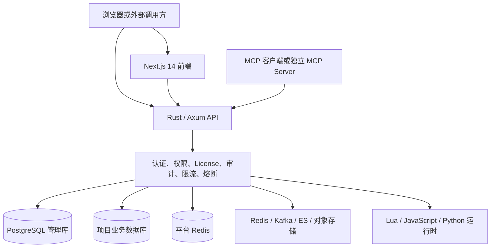
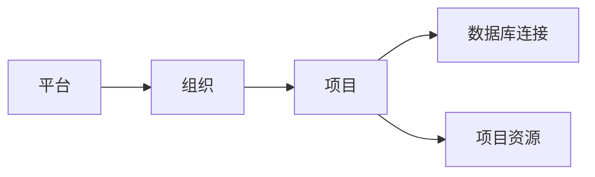
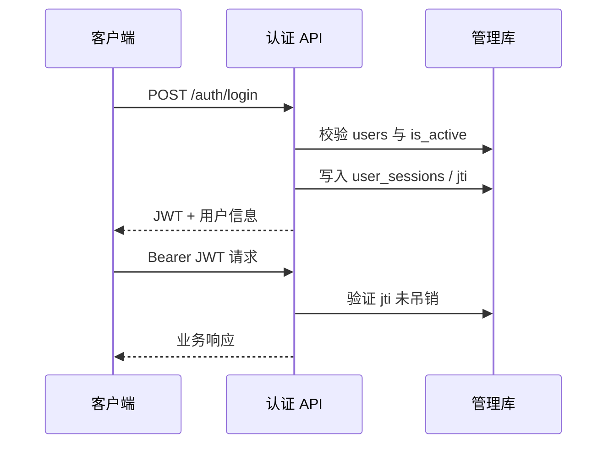
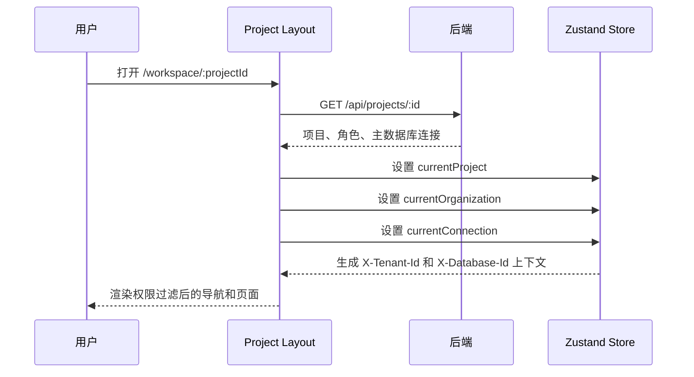

# OneBase 功能框架与详细说明

> 文档基线：当前 `main` 分支，提交 `751aa6e`  
> 适用对象：产品、研发、测试、实施、运维与二次开发人员  
> 说明：本文以当前代码为准。仓库目录仍为 `onebase`，产品名、Rust crate 与对外能力统一使用 **OneBase**。

## 1. 产品定位

OneBase 是面向私有化交付场景的数据与自动化平台。其核心目标是将 PostgreSQL 数据库、API、权限、工作流、多数据源和 AI/MCP 能力统一到一个可部署、可审计、可授权的平台中。

平台提供以下主能力：

1. **组织与项目管理**：平台、组织、项目三级管理结构，支持成员、角色与资源隔离。
2. **数据库管理**：管理 PostgreSQL 连接、Schema、表、字段、索引、函数、触发器、扩展、备份与性能诊断。
3. **自动 API**：根据数据库表自动提供 REST 风格的数据接口，并叠加 API Key、RBAC、RLS、限流与熔断。
4. **工作流自动化**：通过可视化 DAG 编排数据库、HTTP、代码、消息队列、对象存储等节点。
5. **数据集成**：管理和调用 Redis、Kafka、Elasticsearch、对象存储及通用工作流数据源。
6. **身份与安全**：支持 JWT、SSO、OIDC、API Key、平台令牌、MCP PAT、RBAC、RLS 与审计。
7. **可观测性**：提供执行日志、操作日志、HTTP 审计、慢查询、连接池、告警与平台监控。
8. **AI/MCP 接入**：内置 MCP HTTP 入口，并提供独立 Node MCP 服务。
9. **商业授权**：通过离线 RSA License 控制到期策略和 AI、数据管道等模块。

## 2. 总体架构



### 2.1 分层职责

| 层级 | 主要职责 | 关键目录 |
|---|---|---|
| 展示层 | 平台、组织、项目工作区和工作流编辑器 | `frontend-nextjs/app`、`frontend-nextjs/components` |
| API 层 | 路由、Handler、协议适配 | `src/main.rs`、`src/*_handlers.rs` |
| 安全层 | JWT、令牌、RBAC、RLS、License、审计 | `src/auth*.rs`、`src/middleware.rs`、`src/permissions.rs`、`src/license.rs` |
| 领域层 | 组织、项目、数据库、工作流、数据源、监控 | `src/organization_handlers.rs`、`src/workflow_engine.rs` 等 |
| 数据层 | 管理库、项目业务库、Redis 与外部数据源 | `src/db.rs`、`src/pool_manager.rs`、`src/*_ds` |
| 运行时层 | Lua、Node.js、Python 代码节点 | `src/lua_engine.rs`、`src/js_runner.rs`、`src/py_runner.rs` |
| 部署层 | AIO、应用镜像、Compose、Supervisord | `Dockerfile*`、`docker/`、`docker-compose*.yml` |

### 2.2 两类数据库

OneBase 明确区分管理库和项目业务库：

- **管理库**保存用户、组织、项目、成员、连接信息、RBAC、工作流定义、执行索引、审计、监控和数据源配置。
- **项目业务库**保存客户业务数据，是 Auto API、DDL、查询、RPC 和工作流数据库节点的实际操作目标。
- 前端的 `projectId` 表示项目，也就是后端历史命名中的 `tenant_id`。
- `database_id` 表示项目下的具体数据库连接，不能与 `projectId` 混用。
- 前端通过 `X-Tenant-Id` 传递项目上下文，通过 `X-Database-Id` 选择数据库连接。

## 3. 技术栈与代码结构

### 3.1 主要技术栈

- 后端：Rust 2021、Axum 0.7、Tokio、Tower、SQLx。
- 主数据库：PostgreSQL。
- 平台缓存与多实例协调：Redis。
- 前端：Next.js 14 App Router、React 18、TypeScript、Tailwind CSS。
- 状态管理：Zustand；项目已引入 React Query，当前多数业务仍使用 Axios 与组件状态。
- 工作流画布：React Flow。
- 依赖图、回放图：AntV G6。
- 工作流脚本：Lua 5.4、Node.js 20、CPython 3。
- 外部集成：Kafka、Elasticsearch、S3 兼容对象存储、SMTP、Webhook。
- MCP：后端内置 JSON-RPC MCP + 独立 Node MCP 服务。

### 3.2 顶层目录

```text
src/                    Rust 后端与共享库
frontend-nextjs/        Next.js 前端
migrations/             管理库和业务库 SQL 迁移
docker/                 容器入口与 Supervisord 配置
js-runtime/             JavaScript 工作流运行时
py-runtime/             Python 工作流运行时
mcp-server/             独立 Node MCP 服务
tests/                  Shell 与 Rust 集成测试
docs/                   设计、计划、交付和本说明文档
examples/               API、工作流与开通示例
scripts/                SQL 校验与上游同步脚本
website/                OneBase 静态落地页
```

## 4. 用户、组织和项目模型

### 4.1 业务层级



- **平台**：由超级管理员维护，负责全部组织、用户、资源池、平台监控和全局配置。
- **组织**：客户或业务单元的管理边界，包含组织成员和多个项目。
- **项目**：实际资源与权限边界，对应代码中的 `tenant`。
- **数据库连接**：项目可以包含主连接和其他连接，前端当前连接决定数据库操作目标。
- **项目资源**：RBAC、工作流、API Key、数据源、环境变量、日志等均以项目隔离。

### 4.2 组织能力

后端实现位于 `src/organization_handlers.rs`，前端入口位于 `frontend-nextjs/app/org/[orgId]/page.tsx`。

组织控制台提供：

- 组织创建、详情和设置。
- owner、admin、member 三级组织成员管理。
- 组织 owner 转让。
- 组织下项目创建、列表、归档与成员分配。
- 成员与项目访问矩阵。
- 跨项目统计、监控、审计、操作日志和执行日志。
- 跨项目安全配置概览。

核心迁移：`migrations/060_organizations.sql`。

### 4.3 项目能力

后端主要实现于 `src/tenant_handlers.rs`，前端项目壳位于 `frontend-nextjs/app/workspace/[projectId]/layout.tsx`。

项目包含：

- 项目资料、状态和模板。
- 项目成员及 owner、admin、member、viewer 角色。
- 数据库连接、主连接和只读副本。
- RBAC、API Key、RPC ACL 和 RLS 配置。
- 工作流、定时任务、Webhook、SSE 和数据源。
- 项目级监控、执行日志和操作日志。
- 项目环境变量、网关域名和公开 API 基址。

## 5. 认证、会话与权限

### 5.1 认证方式

| 凭证 | 前缀或形式 | 主要用途 |
|---|---|---|
| JWT | Bearer JWT | 浏览器控制台和管理 API |
| Auto API Key | `ob_` | 表数据 Auto API |
| 平台服务令牌 | `obp_` | 自动化、项目和工作流 API |
| MCP PAT | `obm_` | 内置 `/mcp` |
| ES Token | `obes_es_` | Elasticsearch 数据面 |
| Kafka Token | `obes_kafka_` | Kafka 数据面 |
| 对象存储 Token | `obes_os_` | 对象存储数据面 |

### 5.2 JWT 会话流程



相关文件：

- `src/auth.rs`：JWT Claims、签发和验签。
- `src/auth_handlers.rs`：注册、登录、登出、刷新和改密。
- `src/middleware.rs`：统一认证中间件。
- `migrations/012_jwt_sessions.sql`：服务端会话与吊销。
- `frontend-nextjs/lib/auth.ts`：token 与 cookie 双写。

### 5.3 权限层次

权限由多个层次共同构成：

1. 平台超级管理员。
2. 组织 owner、admin、member。
3. 项目 owner、admin、member、viewer。
4. 项目内 RBAC 角色与表级权限。
5. API Key 自身携带的表、操作、行和列权限。
6. PostgreSQL RLS 行级策略。
7. RPC ACL 和工作流 API scope。
8. License 模块权限。

前端权限只负责菜单和交互体验，后端 `permissions.rs`、`rbac_middleware.rs` 和各 Handler 才是权威鉴权点。

## 6. 前端功能框架

### 6.1 登录后入口

登录后根据用户身份分流：

- 超级管理员进入 `/platform/organizations`。
- 普通用户有多个组织时进入 `/orgs`。
- 普通用户只有一个组织时进入 `/org/{orgId}`。
- 无组织或项目时进入引导页。
- 强制改密用户进入 `/change-password`。

### 6.2 平台控制台

平台控制台位于 `frontend-nextjs/app/platform`，仅超级管理员可用。

主要页面：

- 组织管理：组织创建、owner 指定和组织状态维护。
- 全部项目：按组织查看项目。
- 用户管理：用户、状态和平台权限。
- 审计日志：平台 HTTP 审计。
- 执行日志：统一执行索引与详情。
- SSO 管理：平台级登录身份源。
- 定时任务：任务配置和运行记录。
- 平台监控：流量、运行时、异步任务、异常信号和告警。
- PostgreSQL 池：资源池与连接管理。
- 平台设置：公开基址、网关和开通配置。

侧栏定义：`frontend-nextjs/components/PlatformSidebar.tsx`。

### 6.3 组织控制台

组织控制台是 `/org/[orgId]` 下的单页多视图控制台，包括：

- 项目。
- 成员。
- 访问矩阵。
- 统计。
- 监控。
- 审计。
- 操作日志。
- 执行日志。
- 安全总览。
- 组织设置。

侧栏定义：`frontend-nextjs/components/OrgSidebar.tsx`。

### 6.4 项目工作区

项目工作区使用侧栏、顶部项目切换器和多 Tab 保活布局。

核心文件：

- `frontend-nextjs/app/workspace/[projectId]/layout.tsx`
- `frontend-nextjs/components/workspace/workspaceNav.ts`
- `frontend-nextjs/components/workspace/WorkspaceSidebar.tsx`
- `frontend-nextjs/components/workspace/ProjectTopbar.tsx`
- `frontend-nextjs/components/workspace/WorkspaceTabBar.tsx`
- `frontend-nextjs/components/workspace/KeepAliveOutlet.tsx`
- `frontend-nextjs/lib/workspaceTabs.ts`

进入项目后的关键流程：



### 6.5 项目工作区功能分组

#### 概览

- 项目首页。
- 数据库、工作流和近期活动概览。
- 周期刷新项目运行状态。

#### 数据库

- 表数据与表结构。
- 可视化表设计器。
- Schema 浏览器。
- 数据关系图。
- 索引、函数、触发器和扩展。
- SQL 编辑器与事务编辑器。
- 数据导入。
- 备份与恢复。

#### 自动化

- 工作流列表与编辑器。
- 工作流依赖图。
- 工作流执行回放。
- 工作流版本浏览与恢复。
- 定时任务。
- 会话规则。

#### API 与集成

- REST API 文档。
- RPC 调用器和 RPC ACL。
- Webhook。
- SSE 路由、Notify Bridge 和公开端点。
- 通用工作流数据源和凭证。
- Elasticsearch、Redis、Kafka、对象存储连接。

#### 安全

- 项目角色和权限。
- RLS 配置说明。
- API Key、MCP PAT 与平台令牌。
- 项目 IdP 与 OIDC 客户端。
- 网关策略。

#### 诊断与运维

- 项目监控大盘。
- 执行日志和操作日志。
- SQL 语句分析。
- 慢查询。
- 锁与阻塞。
- 数据库连接和只读副本。

#### 设置

- 项目信息。
- 成员。
- 环境变量。
- 数据库连接。
- 网关域名。

## 7. 数据库管理与 Auto API

### 7.1 数据库连接管理

项目可配置一个或多个数据库连接：

- 连接凭证使用平台加密模块保存。
- 主连接用于前端默认数据库上下文。
- 支持连接排序和切换。
- 支持只读副本及健康检查。
- 租户连接池由 `src/pool_manager.rs` 动态创建、缓存与复用。

### 7.2 Schema 与 DDL

- `src/schema_handlers.rs`：Schema、表、列、函数、扩展等元数据。
- `src/ddl_handlers.rs`：结构化建表、改表和 DDL 操作。
- `src/index_handlers.rs`：索引管理。
- `src/query_perf_handlers.rs`：语句分析和慢查询。
- `src/export_handlers.rs`：数据导出。
- `src/monitor_handlers.rs`：项目数据库监控。

### 7.3 Auto API

主路由：

```text
/api/v1/:database_slug/:schema/:table
/api/v1/:database_slug/:schema/:table/:id
```

处理链：


关键文件：

- `src/auto_api_handlers.rs`
- `src/rbac_middleware.rs`
- `src/query_builder.rs`
- `src/postgrest_compat.rs`
- `src/permission_cache.rs`

Auto API 支持：

- 查询、新增、更新、删除。
- API Key 和 JWT 两类调用。
- 表级操作权限。
- 行条件和列权限。
- PostgreSQL RLS 会话用户注入。
- Redis 查询缓存。
- 数据变更事件发布。
- PostgREST 风格兼容路径。

### 7.4 RPC 与 SQL

- `/api/v1/:database_slug/rpc/:fn_name`：调用数据库函数。
- `/api/v1/:database_slug/sql`：v1 SQL 通道。
- `/query`：管理控制台 SQL 编辑器。
- `/transaction`：事务执行。
- RPC ACL 用于限定函数调用权限。
- Raw SQL 路径通过 `src/raw_sql_guard.rs` 添加安全约束和会话保护。

## 8. RBAC 与 RLS

### 8.1 RBAC

RBAC 主要数据结构：

- 角色。
- 权限。
- 角色与权限关联。
- 用户与角色关联。
- API Key 自定义权限。

关键文件：

- `migrations/005_rbac_tables.sql`
- `migrations/011_seed_default_permissions.sql`
- `src/rbac_handlers.rs`
- `src/rbac_models.rs`
- `src/rbac_middleware.rs`
- `src/permission_cache.rs`

### 8.2 RLS

Auto API 在数据库事务中注入：

```sql
set_config('app.current_user_id', '<当前用户ID>', true)
```

业务库可通过 `migrations/013_rls_helpers.sql` 中的 `app.current_user_id()` 建立 PostgreSQL RLS policy。

边界说明：

- RLS helper 需要部署到项目业务库，不属于管理库自动迁移。
- 平台不会自动为客户业务表创建 RLS policy。
- 控制台 Raw SQL 与部分工作流数据库节点不等同于 Auto API 的 RLS 注入路径。

## 9. 工作流系统

### 9.1 核心组成

| 组成 | 文件 |
|---|---|
| HTTP 管理与触发 | `src/workflow_handlers.rs` |
| DAG 引擎 | `src/workflow_engine.rs` |
| 文件夹与分类 | `src/workflow_folder_handlers.rs`、`src/workflow_taxonomy.rs` |
| Cron 触发 | `src/workflow_cron_trigger.rs` |
| Hook 触发 | `src/workflow_trigger.rs` |
| PostgreSQL Notify | `src/workflow_notify_trigger.rs` |
| Kafka 触发 | `src/workflow_kafka_trigger.rs` |
| 前端管理器 | `frontend-nextjs/components/workflow/WorkflowsManager.tsx` |
| 可视化画布 | `frontend-nextjs/components/workflow/WorkflowCanvas.tsx` |

### 9.2 工作流定义

工作流由以下数据构成：

- 基本信息：名称、slug、分类、部门、启用状态。
- 触发配置：触发类型及对应参数。
- 节点数组：节点类型、位置、配置。
- 边数组：节点连接和条件分支。
- 环境与依赖：项目环境变量、JS/Python 依赖。
- 超时与错误策略。
- 文档和公开分享状态。

### 9.3 节点类型

当前引擎支持：

- Lua、JavaScript、Python 代码。
- PostgreSQL 查询、写入和事务。
- ForEach。
- HTTP 调用。
- 邮件发送。
- 条件分支。
- JSON 转换。
- Endpoint Response。
- SSE 发布。
- 调用子工作流。
- Redis。
- Kafka。
- 对象存储。
- Loop。

模板可引用触发数据、节点输出、循环上下文和环境变量。

### 9.4 触发方式

| 类型 | 机制 |
|---|---|
| Manual | 控制台或管理 API 手工触发 |
| Endpoint | 通过 `/workflow/*` 或 `/pub/workflow/*` 调用 |
| Cron | 分钟级扫描，多实例去重 |
| Hook | Auto API 数据变化事件 |
| Notify | PostgreSQL LISTEN/NOTIFY |
| Kafka | Kafka Consumer，成功后提交 offset |

工作流 Endpoint 和流式接口不使用普通 API 的全局短超时，避免长任务被 30 秒超时提前终止。

### 9.5 执行数据

- `workflow_runs` 保存工作流运行状态、触发数据和节点结果。
- `execution_index` 提供 API、工作流、调度器和 RPC 的统一执行索引。
- `execution_logs` 保存细粒度日志。
- `trace_id` 贯穿请求和后台执行。
- stale run 后台任务负责收口异常中断的运行。

### 9.6 前端工作流扩展

#### 依赖图

- 页面：`frontend-nextjs/app/workspace/[projectId]/automation/workflow-graph/page.tsx`
- 图组件：`frontend-nextjs/components/workflow/graph/WorkflowGraphCanvas.tsx`
- 展示工作流之间的 `call_workflow` 依赖关系。
- 支持按部门、分类筛选和聚焦节点。

#### 执行回放

- 组件：`frontend-nextjs/components/workflow/replay/ExecutionReplayView.tsx`
- 将工作流定义与单次运行的节点结果合并显示。
- 支持查看节点输入、输出、错误、耗时和执行状态。

#### 版本管理

- 组件目录：`frontend-nextjs/components/workflow/version`
- 支持版本列表、快照查看和恢复。
- 恢复旧版本时生成新版本，不直接覆盖历史。

## 10. 数据源与数据管道

### 10.1 通用设计

数据源连接信息存储在管理库，并绑定项目。工作流运行时按项目检查连接归属，避免跨项目使用。

数据管道类接口受 License 的 `pipeline` 模块控制。

### 10.2 Redis

- 管理与执行：`src/redis_handlers.rs`
- 工作流领域模块：`src/redis_ds`
- 平台 Redis：`src/redis_manager.rs`

项目 Redis 与平台 Redis 是两个概念：

- 项目 Redis 用于客户数据和工作流节点。
- 平台 Redis 用于权限缓存、限流、Pub/Sub 和多实例协调。

### 10.3 Kafka

- 管理接口：`src/kafka_handlers.rs`
- Token 数据面：`src/kafka_app_handlers.rs`
- 工作流节点：`src/kafka_ds`
- 触发器：`src/workflow_kafka_trigger.rs`

### 10.4 Elasticsearch

- 管理接口：`src/es/admin_handlers.rs`
- 透传代理：`src/es/proxy_handler.rs`
- 高层应用 API：`src/es/app_handlers.rs`
- Token 与租户隔离：`src/es/auth.rs`、`src/es/proxy_common.rs`

### 10.5 对象存储

- 管理接口：`src/object_storage_handlers.rs`
- Token 数据面：`src/object_storage_app_handlers.rs`
- 工作流节点：`src/object_storage_ds`
- 支持 S3 兼容服务，包括 MinIO、OSS、COS 等配置方式。

### 10.6 通用工作流数据源与凭证

- `src/datasource_handlers.rs`
- 项目可集中管理工作流数据源和加密凭证。
- 引擎运行时解析连接配置，不在工作流定义中保存明文敏感信息。

## 11. 实时能力

实时体系包括：

- 进程内 EventBus：`src/events.rs`
- WebSocket：`src/realtime.rs`
- SSE：`src/sse.rs`
- 数据变更到 SSE：`src/sse_route_manager.rs`
- PostgreSQL Notify 到 SSE：`src/sse_notify_bridge.rs`
- Redis Pub/Sub：`src/redis_pubsub.rs`、`src/sse_redis.rs`

支持场景：

- Auto API 数据变化推送。
- 工作流节点主动发布 SSE。
- PostgreSQL NOTIFY 桥接。
- 公开事件端点。
- 多实例下通过 Redis 协调消息。

## 12. SSO 与 OIDC

### 12.1 平台作为登录客户端

`src/sso.rs` 和 `src/sso_handlers.rs` 实现 OneBase 登录 SSO，支持预设 Provider 和通用 OIDC。

流程：

1. 前端获取可用 Provider。
2. 后端生成授权地址和 PKCE/State。
3. 用户在外部身份源完成认证。
4. 回调换取上游用户信息。
5. 创建或绑定 OneBase 用户。
6. 签发 OneBase JWT。

### 12.2 平台作为 IdP

`src/idp_oidc.rs` 和 `src/idp_handlers.rs` 允许项目将 OneBase 作为 OIDC Provider 对外提供身份能力。

提供：

- OIDC discovery。
- JWKS。
- authorize、token、revoke、userinfo。
- 项目级 Provider、Client、Session 和登录日志管理。

登录 SSO 和对外 IdP 是两套独立功能，不能混为同一配置。

## 13. MCP 与 AI

### 13.1 内置 MCP

- 路由：`POST /mcp`
- 实现：`src/mcp_server.rs`
- 工具：`src/mcp_tools.rs`
- 鉴权：`obm_` PAT
- License：`ai` 模块

主要工具覆盖：

- 获取节点规范。
- 工作流列表、详情、创建、更新。
- 调试和运行工作流。
- 获取运行记录。
- 获取版本和 API 文档。

### 13.2 独立 MCP Server

`mcp-server` 是 Node.js 服务，使用 `obp_` 平台令牌调用 OneBase HTTP API。

适合：

- 在 Cursor 或其他 MCP Host 中管理项目和工作流。
- 通过 scope 限制项目创建、工作流读写和运行权限。

## 14. 监控、日志与审计

### 14.1 HTTP 审计

- 中间件：`src/audit_middleware.rs`
- 查询：`src/audit_handlers.rs`
- 记录请求主体摘要、用户、资源、状态码和耗时。

### 14.2 操作日志

- 写入：`src/operation_log.rs`
- 查询：`src/operation_log_handlers.rs`
- 记录组织、项目及资源层面的业务操作。

### 14.3 执行日志

- 统一索引：`src/execution_log.rs`
- 查询 API：`src/execution_log_handlers.rs`
- 覆盖 API、工作流、定时任务和 RPC。

### 14.4 平台监控

- 实现：`src/platform_monitor_handlers.rs`
- 告警：`src/alert_webhook.rs`
- 提供健康度、流量、运行时、异步任务、异常信号、趋势和告警。

### 14.5 数据库诊断

- 活跃连接。
- 锁与阻塞。
- 慢查询。
- SQL 分析。
- 连接池状态。
- 只读副本健康。

### 14.6 网关治理

- 限流：`src/rate_limiter.rs`
- 熔断：`src/circuit_breaker.rs`
- 管理接口：`src/gateway_handlers.rs`
- Redis 不可用时，部分限流能力可回落到本地内存；多实例生产环境建议要求 Redis。

## 15. License 商业授权

### 15.1 组成

- 核心：`src/license.rs`
- CLI：`src/bin/license_tool.rs`
- 公钥：`src/license_public.pem`
- 状态接口：`GET /api/license`

### 15.2 工作方式

License 使用 RSA 签名 JSON，包含客户、有效期、宽限期、部署指纹和模块列表。

状态包括：

- Active
- Grace
- Expired
- Invalid
- Missing
- Unlicensed

`ONEBASE_LICENSE_ENFORCE` 支持：

- `off`：不执行授权限制。
- `warn`：记录状态但不阻断，默认模式。
- `enforce`：到期或无效时限制写操作。

### 15.3 模块闸门

- MCP 使用 `ai` 模块。
- Elasticsearch、Redis、Kafka 和对象存储使用 `pipeline` 模块。
- 全局 License 中间件负责到期后的只读降级。
- License 状态后台周期刷新，更换授权文件后通常无需重启。

## 16. 数据库迁移

### 16.1 迁移机制

- 单一执行清单位于 `src/migrate.rs`。
- SQL 文件通过 `include_str!` 编译进程序。
- `AUTO_MIGRATE=on` 时启动自动迁移。
- 多实例通过 PostgreSQL advisory lock 保证只有一个实例执行。
- SQL 设计为幂等，重复对象错误可按规则跳过。

### 16.2 关键迁移

| 领域 | 迁移 |
|---|---|
| 用户 | `001_create_users_table.sql` |
| 管理 Schema | `003_create_management_schema.sql` |
| RBAC | `005_rbac_tables.sql`、`011_seed_default_permissions.sql` |
| SSO | `006_sso_providers.sql` 起的 SSO 系列 |
| 审计 | `009_audit_logs.sql` |
| JWT 会话 | `012_jwt_sessions.sql` |
| 工作流 | `022_workflows.sql` |
| 工作流版本 | `029_workflow_versions.sql` |
| MCP PAT / 平台令牌 | 两个 `030_*` 迁移 |
| 项目环境变量 | `031_project_env_vars.sql` |
| 执行日志 | `036_execution_logs.sql` |
| IdP | `041` 至 `045` 系列 |
| Redis / 数据源 | 多个 `046_*` 迁移 |
| 平台监控 | `050_platform_monitor.sql` |
| Kafka | `052`、`053` |
| 工作流依赖与搜索 | `054`、`055` |
| 操作日志 | `056_operation_logs.sql` |
| 对象存储 | `057`、`058` |
| 用户状态 | `059_users_is_active.sql` |
| 组织层级 | `060_organizations.sql` |

注意：迁移编号存在并行功能分支造成的重复，实际执行顺序以 `src/migrate.rs` 为准，不能仅按文件名排序。

## 17. 配置与部署

### 17.1 必要配置

生产环境至少需要：

- `DATABASE_URL`
- `JWT_SECRET`
- `ENCRYPTION_KEY`

常用配置分组：

- API：`HOST`、`PORT`、`CORS_ORIGINS`
- Redis：`REDIS_URL`、`REQUIRE_REDIS`
- 迁移：`AUTO_MIGRATE`
- 项目开通：`PROVISION_PG_URL`、`PROVISION_WEBHOOK_*`
- 连接池：`TENANT_POOL_*`、`TENANT_DB_*`
- 工作流：`WORKFLOW_*`
- 执行日志：`EXEC_LOG_*`、`EXEC_INDEX_*`
- SSE：`SSE_*`
- License：`ONEBASE_LICENSE_*`
- 日志：`LOG_DIR`、`LOG_FILE`

权威模板：`.env.example`。

### 17.2 部署模式

| 模式 | 文件 | 说明 |
|---|---|---|
| 本地开发 | Cargo + Next.js dev | 后端默认 3000，前端开发 3006 |
| AIO | `Dockerfile.aio` | 内置 PostgreSQL、Redis、API、前端 |
| 应用镜像 | `Dockerfile` | 外接 PostgreSQL 与 Redis |
| Compose | `docker-compose.yml` | AIO 编排 |
| 本地 Compose 覆盖 | `docker-compose.override.yml` | 常用映射为 3010/3011 |

### 17.3 健康检查

- `/health`：基础健康。
- `/health/live`：不访问数据库的存活检查。
- `/health/ready`：检查数据库的就绪探针。

## 18. 后台任务

服务启动后会运行多类后台任务：

- 工作流 Hook、Notify、Kafka、Cron 触发器。
- 定时任务调度器。
- stale workflow run 收口。
- 执行日志清理。
- 平台监控采样和告警。
- 项目数据库池预热。
- 只读副本和连接池 Watchdog。
- License 周期刷新。

这些任务依赖管理库状态，多实例部署时通过数据库锁、唯一约束、状态 claim 或消息系统避免重复执行。

## 19. 测试与验证

### 19.1 Shell 集成测试

`tests/` 中包括：

- `integration_test.sh`
- `m1_workspace_test.sh`
- `m1_workspace_members_test.sh`
- `m1_workspace_member_admin_test.sh`
- `m2_provisioning_test.sh`
- `m3_ddl_test.sh`
- `m4_rbac_smoke.sh`
- `m6_dashboard_test.sh`
- `rls_test.sh`

### 19.2 Rust 测试

- 调度器并发 claim。
- 调度器 Handler 鉴权。
- SQL 迁移切分。
- License 状态与验签。
- 工作流引擎节点行为。

### 19.3 推荐验证顺序

1. `cargo fmt --all -- --check`
2. Linux 或 Docker 中运行 `cargo check`
3. `cargo test license`
4. `cd frontend-nextjs && npm ci`
5. `npm run build`
6. 启动 Compose 后执行 Shell 集成测试
7. 对组织、项目、Auto API、工作流和 License 做人工冒烟

Windows 原生构建可能因 `libsasl2` 缺失而失败，建议使用 Linux 或 Docker 完成 Rust 全量验证。

## 20. 关键业务调用链

### 20.1 登录并进入项目

```text
登录
→ JWT 与 user_sessions
→ 获取组织列表
→ 进入组织
→ 选择项目
→ 获取项目详情和主数据库连接
→ 设置 X-Tenant-Id 与 X-Database-Id
→ 按项目角色展示工作区导航
```

### 20.2 Auto API 写入触发工作流

```text
API Key/JWT 请求
→ 认证
→ database_slug 解析
→ 租户数据库池
→ RBAC/API Key 权限
→ SQL 写入与 RLS 上下文
→ 发布 DataChangeEvent
→ Hook 工作流匹配
→ DAG 执行
→ workflow_runs + execution_index + execution_logs
```

### 20.3 工作流执行

```text
Manual / Endpoint / Cron / Hook / Notify / Kafka
→ execute_workflow_internal
→ 创建 workflow_run 和 trace_id
→ DAG 拓扑调度
→ 模板解析
→ 节点执行
→ 保存 node_results
→ 更新运行状态
→ 写统一执行索引
```

### 20.4 License 限制

```text
请求进入 Router
→ LicenseState Extension
→ 全局写操作中间件
→ 到期/无效时 enforce 只读降级
→ AI 或数据管道路由再检查模块授权
→ 允许处理或返回授权错误
```

## 21. 当前实现边界与注意事项

1. 仓库中部分根文档仍描述旧 `/admin/` 页面，当前真实前端入口是 `/platform`、`/orgs` 和 `/workspace`。
2. 项目 ID 与数据库连接 ID 是不同概念，二次开发时不得混用。
3. 管理库迁移顺序以 `src/migrate.rs` 为准，迁移文件编号并非唯一。
4. RLS helper 需要安装到业务数据库，平台不会自动替客户创建业务表 policy。
5. 旧明文令牌前缀不兼容当前 `ob*` 前缀，升级时需要重新签发相关凭证。
6. 前端中间件只做 token 存在性和过期剪枝，不能替代后端验签和鉴权。
7. 多实例生产环境应配置 Redis，并审查 Cron、Kafka、SSE 和执行日志的容量参数。
8. JavaScript、Python 代码节点属于子进程运行，生产环境应启用沙箱并限制依赖安装来源。
9. License 公钥、私钥和授权文件需按交付规范管理，私钥和 `.lic` 文件不得提交仓库。
10. `frontend-nextjs/.env` 中的 `NEXT_PUBLIC_*` 会进入浏览器包，不能存放真实秘密。

## 22. 主要源码索引

| 主题 | 入口 |
|---|---|
| 后端启动和路由 | `src/main.rs` |
| 共享库 | `src/lib.rs` |
| 配置 | `src/config.rs`、`.env.example` |
| 认证 | `src/auth.rs`、`src/auth_handlers.rs`、`src/middleware.rs` |
| 权限 | `src/permissions.rs`、`src/rbac_handlers.rs`、`src/rbac_middleware.rs` |
| 组织 | `src/organization_handlers.rs` |
| 项目 | `src/tenant_handlers.rs` |
| 数据库池 | `src/pool_manager.rs`、`src/pg_pool_handlers.rs` |
| Auto API | `src/auto_api_handlers.rs` |
| 工作流 | `src/workflow_handlers.rs`、`src/workflow_engine.rs` |
| 定时任务 | `src/scheduler`、`src/scheduler_handlers.rs` |
| MCP | `src/mcp_server.rs`、`src/mcp_tools.rs`、`mcp-server/` |
| License | `src/license.rs`、`src/bin/license_tool.rs` |
| 监控 | `src/platform_monitor_handlers.rs`、`src/monitor_handlers.rs` |
| 审计 | `src/audit_middleware.rs`、`src/audit_handlers.rs` |
| 操作日志 | `src/operation_log.rs`、`src/operation_log_handlers.rs` |
| 前端 API | `frontend-nextjs/lib/api.ts` |
| 前端状态 | `frontend-nextjs/lib/store.ts` |
| 前端权限 | `frontend-nextjs/lib/permissions.ts` |
| 工作区导航 | `frontend-nextjs/components/workspace/workspaceNav.ts` |
| 数据库迁移清单 | `src/migrate.rs` |

## 23. 总结

当前 OneBase 已形成较完整的平台能力闭环：

```text
平台治理
→ 组织和项目
→ 数据库连接
→ 自动 API 与权限
→ 工作流和数据集成
→ MCP/AI 接入
→ 日志、监控、审计
→ License 私有化交付
```

其核心设计特征是：

- 以 PostgreSQL 管理库维护平台元数据。
- 以项目和数据库连接隔离客户业务数据。
- 以统一认证、RBAC、RLS 和 License 构成多层安全边界。
- 以工作流引擎连接数据库、脚本、消息和外部系统。
- 以前端平台、组织、项目三级控制台承载不同角色的操作入口。
- 以 Docker、自动迁移、监控和交付清单支持私有化部署。
