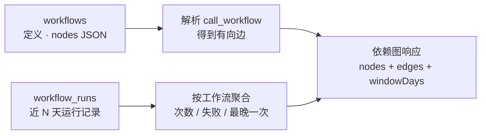
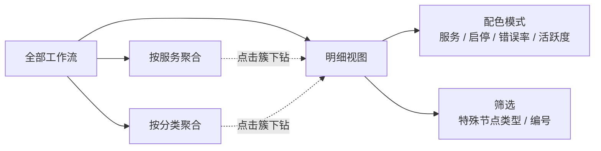
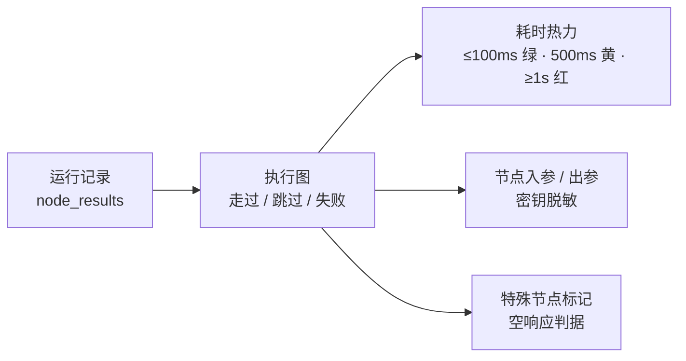

# 工作流依赖图与执行回放设计说明

依赖图回答"全部工作流放在一起是什么样、哪里复杂、哪里在出问题、动一处会牵连谁"；执行回放回答"某一次执行具体走了哪条路、慢在哪、错在哪"。前者是宏观视角，后者是微观视角，两者共用同一套工作流定义与运行记录，不引入新的数据源。

## 1. 背景与问题

平台上的工作流以数百条计，分布在多个服务与分类下；工作流之间通过 `call_workflow` 互相调用，并依赖 Redis、Kafka、HTTP 外部服务、定时与 Notify 触发等特殊节点。高频工作流的执行量达到每天数万次。

在此之前平台只有两个入口：工作流列表和执行记录。它们无法回答以下问题：

| 问题 | 原有入口的局限 |
|---|---|
| 哪个服务的业务最复杂，哪些工作流臃肿到该拆 | 列表只有条数，看不出结构 |
| 某个外部依赖出问题会波及多少条、哪些工作流 | 依赖关系藏在每条工作流的节点配置里 |
| 哪些工作流持续出错需要追查，哪些早已无人使用可以下线 | 需要逐条翻执行记录 |
| 一次执行为什么慢、为什么失败 | 只有日志文本和最终结果，节点级过程不可见 |

## 2. 依赖图

### 2.1 数据模型

一个节点对应一条工作流，一条有向边对应一次 `call_workflow` 调用（from 调用 to）。边的解析复刻引擎语义：同租户内按 slug 解析，只取启用中的目标，解析不到的计入 `unresolved`。

节点携带四类信息：

- 结构：所属服务（department）、分类（category）、内部节点数（nodeCount）、特殊节点类型集合（specialFlags）。
- 健康：启停状态、统计窗口内的运行次数与失败次数、错误率、活跃度。
- 外部标记：筛选或下钻时，主集之外被牵连进来的节点标 `external`。

这张图说明依赖图的两个数据来源：结构来自工作流定义，健康度来自运行记录，在接口层合并。

### 2.2 三层视角

聚合视图把工作流压缩成服务簇或分类簇，簇的大小对应其中的工作流条数，用于看内容量分布，即业务复杂度在各服务、各分类间的分布。点击簇可下钻，看该簇的明细及其一跳外部依赖。

明细视图默认不分簇，三个维度直接编码在图形上：

| 视觉通道 | 含义 | 实现 |
|---|---|---|
| 颜色 | 所属服务 | 按当前图里出现的服务名排序，依次从一张冷暖交替的 20 色调色板取色（前 10 色差异最大，后 10 色为服务超过 10 个预留），同一张图内不撞色；"共享"固定灰色。服务集合变化时颜色可能重新分配，颜色是图内区分用的，不是服务的固定标识 |
| 位置 | 耦合程度 | 极坐标布局：角度按服务分扇区，半径按被依赖数分层，越靠中心被依赖越多 |
| 大小 | 臃肿程度 | 直径按内部节点数幂律缩放（`20 + 6·n^0.7`，封顶 120px），1～80 个节点全区间可区分 |

需要分组视角时可切换为按分类或按服务分簇。

### 2.3 健康度配色

同一张图切换配色模式，从结构视图变为运维视图。所有健康度指标按同一个统计窗口计算，窗口天数由后端返回（`windowDays`），取运行记录保留期与上限（当前 3 天）的较小值，前端文案不写死天数。

| 模式 | 语义 | 用途 |
|---|---|---|
| 启停 | `is_enabled` | 找已关闭但未清理的工作流 |
| 错误率 | 窗口内 (failed + timeout) / total | 分档：0 / ≤1% / ≤5% / ≤20% / >20%，窗口内无运行单独一档 |
| 活跃度 | 窗口内最晚一次运行距今 | 24 小时内 / 窗口内 / 窗口外无运行 |

错误率采用离散分档而非线性渐变：真实错误率绝大多数落在 0～5%，线性刻度下 5% 与 0% 几乎同色，没有信号；分档按事故等级跳变，1% 已经是需要追查的级别。窗口内无运行单独成档，避免"因为没跑所以 0%"冒充健康。

选中节点后侧栏显示窗口内运行次数、失败次数与百分比。追查时先看量级：十几万次里失败几百次，与几十次里失败一半，是完全不同的问题。

### 2.4 筛选与影响面

两种筛选来源取并集作为本体集合：

- 特殊节点类型：定时、Redis、Kafka、Notify、SSE、HTTP 外调。这些节点涉及外部系统，相关工作流的改动需要谨慎。
- 编号多选：粘贴一批工作流 id，逗号、空格、换行分隔。

筛选生效后不再是全图淡出，而是只渲染本体及其沿调用边递归到底的全部下游依赖。服务色模式下本体统一靛蓝、下游依赖统一琥珀，其它配色模式照常；依赖节点的布局锚点挪到其上游附近，链路自然贴近本体。由此，"某个 Kafka 出问题会影响哪些工作流"直接是一张图。

## 3. 执行回放

执行回放是执行记录的补充：把一次执行画回该工作流的图上。

- 路线：走过的节点、分支拐点、未走到的节点区分显示。
- 耗时热力：每个节点按耗时着色，慢在哪一步直接可见。
- 入参出参：点击节点查看输入与输出，项目环境变量的值自动脱敏。
- 特殊节点与空响应：走过的 Redis / Kafka / HTTP 节点带标记；节点输出为空时给出具体判据（查询未命中、接口返回空、条件均不满足等），而不是只显示 null。

目标是执行慢或失败时，工作人员自己就能定位到具体节点与原因，AI 是辅助而非唯一能读懂的角色。

## 4. 性能与数据库压力

依赖图的主要开销是运行状态聚合。设计约束是：单次请求可接受，且任何访问频率下数据库负载有上限。

| 项 | 做法 | 效果 |
|---|---|---|
| 窗口聚合 | 总数与最晚时间走主索引 index-only；失败数走只收失败记录的 partial index（迁移 062） | 从秒级降到百毫秒级，不再回堆扫描运行记录表 |
| 负载上限 | 聚合结果进程内缓存（TTL 见 `DEP_GRAPH_RUN_STATS_TTL`） | 每工作流每个 TTL 周期最多聚合一次 |
| 窗口口径 | 与运行记录保留期对齐 | 图例文案随保留期变化 |
| 大图渲染 | 增量高亮 diff、布局坐标缓存、拖拽期间降级 | 数百节点规模下交互流畅 |

约束与升级路径：

- 失败数查询的谓词必须与 partial index 谓词相同或为其子集，否则计划器静默退回堆扫描。
- 聚合成本与窗口内行数成正比，缓存把频率封顶。流量继续增长时的升级路径是小时桶预聚合表，成本与流量脱钩。

## 5. 待定问题

- 性能还能不能再优化。
- 聚合视图要不要只保留明细，按服务、按分类两个聚合视图是否还有必要。
- 执行日志页是否直接换成回放页面。
